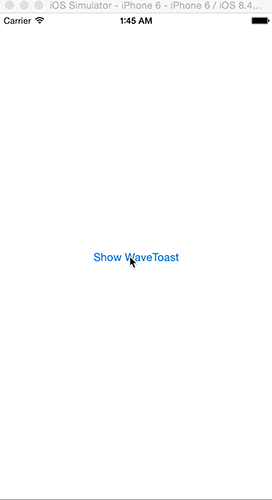

# SAWaveToast

[](https://developer.apple.com/iphone/index.action)
[](https://developer.apple.com/swift)
[](http://cocoapods.org/pods/SAWaveToast)
[](http://cocoapods.org/pods/SAWaveToast)



Show text with wave animated background and floating animation.

## Features

- [x] Wave aniamtion toast
- [x] Support NSAttributedString
- [ ] Culculate wave aniamtion wit gyro

## Installation

#### CocoaPods

SAWaveToast is available through [CocoaPods](http://cocoapods.org). To install
it, simply add the following line to your Podfile:

```
pod "SAWaveToast"
```

#### Manually

Add the [SAWaveToast](./SAWaveToast) directory to your project.

## Usage

If you install from cocoapods, You have to write `import SAWaveToast`.

There are two initialize methods.
```swift
public convenience init(text: String, font: UIFont? = nil, fontColor: UIColor? = nil, waveColor: UIColor? = nil, duration: NSTimeInterval? = nil)
public init(attributedText: NSAttributedString, waveColor: UIColor? = nil, duration: NSTimeInterval? = nil)
```

It is simple to use `SAWaveToast` like `UIAlertController`.
```swift
let controller = SAWaveToast(text: "This is SAWaveToast!!")
presentViewController(controller, animated: false, completion: nil)
```

## Customize

You can customize text.

### String

```swift
let waveToast = SAWaveToast(text: "This is SAWaveToast!!", font: .systemFontOfSize(16), fontColor: .darkGrayColor() waveColor: .cyanColor(), duration: 5)
```

### NSAttributedString

```swift
let attributes: [NSObject : AnyObject] = [
    NSFontAttributeName : UIFont.systemFontOfSize(16),
    NSForegroundColorAttributeName: UIColor.cyanColor()
]
let attributedText = NSAttributedString(string: "This is SAWaveToast!! ", attributes: attributes)
let waveToast = SAWaveToast(attributedText: attributedText, waveColor: .cyanColor(), duration: 5)
```

## Requirements

- Xcode 6.4 or greater
- iOS7.0(manually only) or greater

## Author

Taiki Suzuki, s1180183@gmail.com

## License

SAWaveToast is available under the MIT license. See the LICENSE file for more info.
